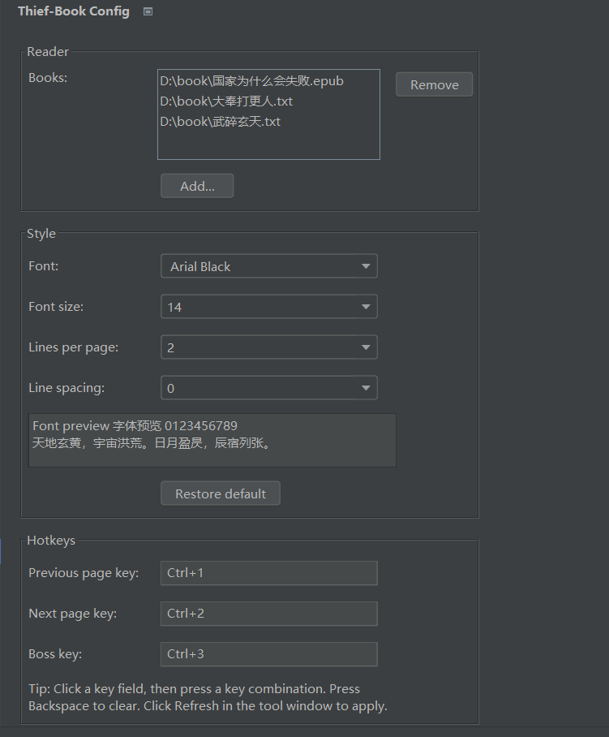
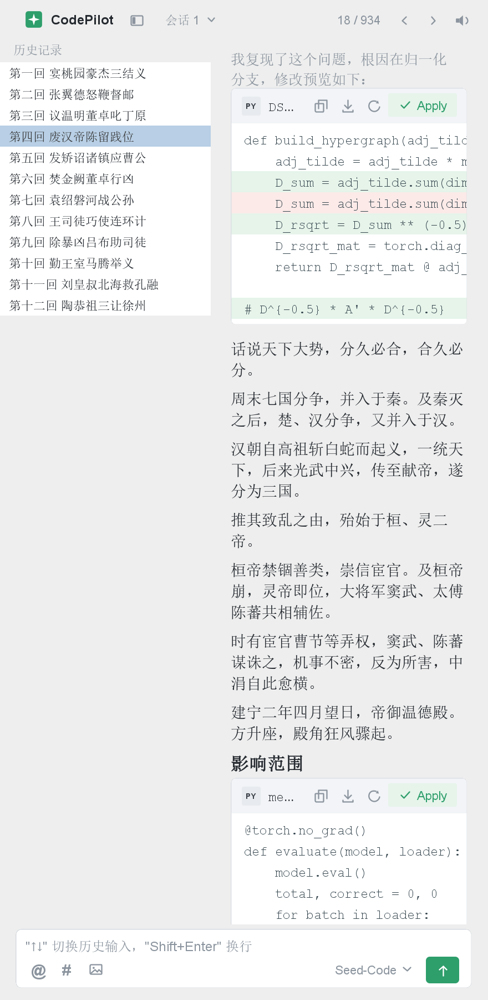
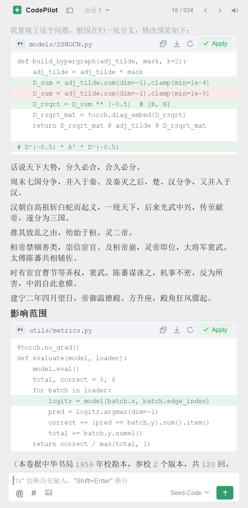

# thief-book-idea

一款 IntelliJ IDEA 插件，让你在 IDE 里悄悄看小说——"摸鱼神器" Thief-Book 的 IDEA 版。灵感来自 [Thief-Book](https://github.com/cteams/Thief-Book)（PC 端 / VS Code 版）。

## 效果图

### 设置页



### 阅读窗口



左侧"历史记录"可一键收起，收起后阅读区自动加宽：



## 功能特性

- **伪装成 AI 编码助手**：阅读窗口长得像一个 AI 编程助手面板——正文就是"助手的回复"，中间穿插伪装的代码 diff 卡片与行内代码块，底部带一个和真助手一模一样的输入框（占位提示、`@` / `#` / 图片按钮、模型选择、绿色发送按钮）
- **单行 shell 命令块**：在较长的自然段**中间**插一条带头部的单行命令（`SH` 角标 + `scripts/xxx.sh` + 复制/导出/重新生成 + 绿色 `Run` 按钮，正文只有一行 `$ 命令`），把段落切成两半，比 diff 卡片更"轻"、更不易察觉
- **代码素材可选语言**：伪装用的 diff 卡片有 Python / Java / Vue 三套素材（文件名、语言角标、代码风格各不相同），在设置里切换即可，一页里不会出现重复片段
- **可自定义的伪装身份**：助手名称（阅读窗口内右键品牌名可改）与模型名都能换；设置页 `Style` 面板还有个 `Custom model` 输入框，**只填名字**，不需要 endpoint / API key，纯装饰
- **IDE 内阅读**：底部工具窗口展示小说内容，无需切出 IDE
- **自定义阅读体验**：字体、字号、每页行数（1~30）、行间距均可配置
- **热键翻页**：默认 `Ctrl+1` 上一页 / `Ctrl+2` 下一页，可在设置中修改
- **老板键**：默认 `Ctrl+3`，整个窗口立刻变成一段终端输出（Tab 标题也改成 `Terminal`），再按一次恢复
- **进度记忆**：阅读进度实时保存，下次打开自动续读
- **跳页**：在底部输入框里输入页码回车即可跳转
- **EPUB 支持**：自动解包 epub 正文，左侧"历史记录"列表可点击跳转章节，正文插图等比缩放显示；目录可一键收起，阅读区自动加宽
- **上下滚动**：正文溢出时阅读区自动出现滚动条，随窗口大小自适应
- **正文可选中复制**：正文、小标题、代码卡片里的代码行与 shell 命令都能用鼠标拖拽选中，`Ctrl+C` 复制，右键还有"复制 / 全选"；文本仍然是只读的（不会误改），也不会出现闪烁的输入光标
- **编码自动识别**：支持 UTF-8（含 BOM）/ GBK / ANSI，切书自动重新检测
- **后台读取**：翻页、跳页、刷新均不阻塞 IDE
- **离线朗读**：点击顶部喇叭按钮朗读小说，读完自动翻下一页续读；右键可选系统语音与语速，全程离线（Windows SAPI / macOS `say` / Linux `espeak-ng`）

## 安装

### 方式一：JetBrains 插件市场（推荐）

`File | Settings | Plugins | Marketplace`，搜索 **thief-book** 安装，重启 IDE。

市场地址：[thief-book-idea](https://plugins.jetbrains.com/plugin/15442-thief-book-idea)

### 方式二：本地安装

1. 从 [GitHub Releases](https://github.com/yisier/thief-book-idea/releases) 下载 `thief-book-idea-<version>.zip`
2. `File | Settings | Plugins`，点击齿轮按钮 → `Install Plugin from Disk...`，选择下载的 zip
3. 重启 IDE

## 使用方式

1. 打开设置：`File | Settings | Other Settings | AI Assistant Config`
2. 在设置页选择一本 **txt / epub** 小说文件，按需调整字体、字号、每页行数、行间距与热键
   （**每页行数**建议 8 行以上，页面看起来才像一段完整的"助手回复"）
3. 点击 `OK` 保存设置
4. 点击 IDE 底部工具窗口 `CodePilot` 标签打开阅读窗口，自动恢复上次进度
5. 在底部输入框输入页码回车可跳页，或直接按 `Ctrl+2` 继续往下读

> 切换书本或修改设置后，无需重启 IDE：改设置点 `Apply` 即生效，切书在顶部"会话"下拉里切换。

### 阅读窗口操作

| 操作 | 方式 |
| --- | --- |
| 下一页 | 点底部绿色发送按钮、点右上方 `›`，或按 `Ctrl+2`（可自定义） |
| 上一页 | 点右上方 `‹`，或按 `Ctrl+1`（可自定义） |
| 输入框内翻页 | 光标在输入框时按 `↑` 上一页、`↓` 下一页 |
| 跳页 | 在底部输入框输入页码（如 `120`）回车；也支持 `/page 120` |
| 命令 | `/next` `/prev` `/play` `/stop` `/boss` `/help` |
| 播放 / 停止朗读 | 点顶部喇叭按钮，或按 `Ctrl+4`（可自定义）；右键喇叭切换语音与语速 |
| 切换书本 | 顶部"会话 N"下拉（配了多本书时才出现） |
| 收起 / 展开历史记录 | 点顶部品牌名右侧的侧栏图标（仅有 epub 目录时出现），收起后阅读区自动加宽 |
| 重命名助手 | 右键顶部品牌名（如 `CodePilot`），可改成任意名字 |
| 选中 / 复制正文 | 直接在正文上拖拽选择，`Ctrl+C` 复制；右键可"复制 / 全选"。代码卡片里的代码行、shell 命令行也能选 |
| 老板键 | 按 `Ctrl+3`（可自定义）：窗口整体伪装成终端输出，再按一次恢复 |
| 恢复窗口 | 误关窗口后，`Window` 菜单 → `Show CodePilot` |

> 输入其它内容不会被当成小说内容，只会显示一句"助手式"的回应，方便在旁人看来这是正常的对话框。

### 设置项说明

| 设置项 | 说明 | 默认值 |
| --- | --- | --- |
| 书本路径 | 选择要阅读的 txt / epub 文件 | 无 |
| 字体 | 阅读区字体，可选"系统默认"跟随 IDE | 系统默认 |
| 字号 | 阅读区字体大小 | 14 |
| 每页行数 | 每页显示的行数（1~30，越大越像一段完整回复） | 8 |
| 行间距 | 段落之间的间隔 | 0 |
| 代码语言 | 伪装代码卡片用的语言：Python / Java / Vue，各有一套素材（文件名、角标、代码风格都跟着换） | Python |
| 自定义模型 | 只填一个模型名即可（**不需要 endpoint / API key**），纯伪装：该名字会出现在输入框右下角的模型列表里 | 空 |
| Shell 代码块 | 是否在较长的自然段**中间**插一条带头部的单行 shell 命令（SH 角标 + 脚本名 + 复制/导出/刷新 + `Run`），把段落切成两半 | 开启 |
| 上一页热键 | 上一页快捷键 | Ctrl+1 |
| 下一页热键 | 下一页快捷键 | Ctrl+2 |
| 老板键 | 隐藏/显示阅读窗口 | Ctrl+3 |
| 朗读热键 | 播放 / 停止朗读 | Ctrl+4 |

> 朗读语音与语速在阅读窗口顶部喇叭按钮的**右键菜单**里选择，无需重启，实时生效。

> 说明：旧版设置页曾提供"精简模式"（隐藏翻页按钮），当前版本未实现，仅为历史遗留字段。

## 常见问题

**1. 小说出现乱码？**
插件会自动识别 UTF-8（含 BOM）/ GBK / ANSI 编码；若仍乱码，可新建一个 UTF-8 编码的空白 txt 文件，把书本内容复制进去再重新选择。

**2. 字体显示异常？**
阅读区字体请选择系统中真实存在的字体，Windows 推荐微软雅黑。

**3. 热键可以自定义吗？**
可以。进入 `Thief-Book Config` 设置页，点击热键输入框后直接按下想要的组合键即可（按 Backspace 清除）。

## 从源码构建

要求 JDK 17（路径见 `gradle.properties`）：

```
./gradlew buildPlugin   # 打包插件，产物在 build/distributions/thief-book-idea-<version>.zip
./gradlew runIde        # 启动本地沙箱 IDEA 调试插件
```

最低兼容 IntelliJ Platform 2023.3（build 233）。

## 更新记录

### V0.3.6（2026-09-23）

- 优化**代码卡片插入算法**，修复"整屏都是正文、看不到任何代码块"的情况（用户再次报过）：
  - 卡片此前只落在段落**之间**，按累计字数分布时，跨越字数阈值的长段落会把卡片间隔撑大到整段长度——一段 2000 字的超长段落能连挡两张卡，滚到那段就是满屏正文。现在**长段落会从句子边界**（句号/问号/叹号等句末标点处，绝不在句子中间硬断）**切开、把卡片插进段落内部**，一段可连续插多张，卡片间隔不再被整段长度撑大
  - 单行 shell 命令与卡片在同一段落冲突时**卡片优先**，避免长段被一条命令独占
  - 普通页面（短段落）的分布与之前完全一致；同一页刷新/老板键恢复的渲染结果仍然一致
  - 量化验证（离线自测 `CardGapCheck`）：最坏样本"一段 2000 字"的相邻代码元素最大正文字数间隔从 **1016 字降到 334 字**（约 10 行），普通页面分布逐像素不变

### V0.3.5（2026-09-23）

- 界面**图标不再模糊**：全部改用开源图标集 [Lucide](https://lucide.dev)（ISC 许可证），并按屏幕像素密度实时渲染。高 DPI 屏（2x / 系统缩放 125%~200%）下此前的图标是被放大插值出来的，现在按目标像素 1:1 绘制，线条锐利、不再有毛边
- 修复**顶部栏与底部输入框的图标没有垂直对齐**：同一条横栏现在所有按钮共用一条中心线。此前左右两组各按自己的行高居中，只要两侧最高元素不同（字号、系统缩放、图标尺寸任一不同就会不同）就会整体错开几像素
- 图标颜色仍按主题与状态（悬停 / 朗读激活 / 侧栏展开收起）动态着色，亮色与暗色主题共用同一份素材；素材来源与许可证见文末「第三方素材」

### V0.3.4（2026-09-23）

- 修复分页引擎**缺少下限保护**：在首页继续"上一页"不再把页码推成负数（页码指示会显示 `-1 / N`），更不会再污染文件指针缓存——越界之后跳页会整体错位一页（实测 `jumpTo(10)` 落在 L21 而不是 L11）。用户能按到的路径本来被"已经是第一条"挡住，现在引擎自己也兜住了
- 文件**读取失败**时界面只显示固定的助手话术，不再把异常原文（常含绝对路径与英文系统提示）渲染进"助手回复"里；真实原因记录到 IDE 日志
- 老板键的按住状态不再依赖窗口实例列表：按下热键期间关闭项目或修改热键，抬起后不会卡在"按住"状态，避免老板键失效到重启 IDE

### V0.3.3（2026-09-20）

- 稳定性修复（内部重构为主，界面无任何变化——预览图逐像素回归验证过）：
  - 朗读与手动翻页**同时进行时不再可能跳页**：翻页是"定位 + 读取 + 推进页码"的复合操作，现在整体串行执行
  - **老板键按住不放**不会连续切换界面（只在按下沿触发一次）
  - 老板键的全局监听只注册一次（之前多项目 / 重复打开窗口会叠加注册且永不注销），项目关闭后自动清理并停止朗读
  - epub 源文件变化重新解包后，**清理上一版的临时 txt 与图片目录**，不再在系统临时目录里累积
  - macOS / Linux 朗读**偶发卡死**：子进程输出未排空会填满管道缓冲区导致 `waitFor` 死锁，已修复；"停止朗读后立刻再点播放没反应"也已修复
  - 配置文件里"每页行数"被手改成 0 时不再除零崩溃；文件读取失败显示友好提示（不再把异常文本渲染进回复），错误写入 IDE 日志（idea.log）
- 修复代码卡片工具栏**"复制"图标的样式**：背面纸张的边线不再穿过正面轮廓（之前看起来像两个完整的方框叠在一起），并补上缺失的底边
- 内部重构：文件读取与分页逻辑从 `MainUi`（1800+ 行）抽成独立的 `book` 引擎模块（`BookPager` / `BookSource`）；配置序列化交给平台 `XmlSerializer`，**`thief-book.xml` 格式完全兼容**，升级后书单、进度与全部设置原样保留

### V0.3.2（2026-09-20）

- 阅读区文字现在**可以选中、可以复制**：正文、小标题、代码卡片里的代码行与 shell 命令行都能拖拽选中并 `Ctrl+C` 复制，右键菜单提供"复制 / 全选"
  - 文本仍然只读（不会误改），且不显示闪烁的输入光标，看起来还是"助手的回复"
  - 修掉"选不中"的根因：可聚焦的文本组件才能建立选区，之前正文被显式设成了不可聚焦

### V0.3.1（2026-09-13）

- 单行 shell 代码块补上**完整的卡片头部**，与 diff 卡片一致：
  - 左侧 `SH` 角标 + 脚本名（`scripts/build.sh` 这种），右侧复制 / 导出 / 重新生成工具栏 + 绿色 **Run** 主按钮（播放图标）
  - 正文仍只有一行 `$ 命令`，提示符用强调色；复制按钮拷的就是这行命令
- 修复窄宽度下卡片头部**文件名与工具栏重叠**的问题：现在按可用宽度三级降级——先收窄文件名（丢目录前缀 → 尾部省略号）→ 再收起复制/导出/刷新三个次要图标（只留主按钮）→ 极端窄时整条工具栏隐藏。diff 卡片与 shell 块共用这套逻辑

### V0.3.0（2026-09-13）

- 新增**单行 shell 代码块**：只占一行，插在自然段**中间**把段落切成两半（`$ ./gradlew build -x test` 这种），和段落之间的 diff 卡片是两套独立的东西
  - 只切"够长且中间有句末标点"的段落（≥40 字），一页最多 2 条，绝不在句子中间硬断
  - shell 命令自成一套素材（10 条），不随 `Code language` 切换
- 设置页 `Style` 面板新增 **Shell snippet in paragraphs** 开关（默认开启）

### V0.2.2（2026-09-13）

- 设置页 `Style` 面板新增 **Custom model** 输入框：**只填模型名**，不需要 endpoint、API key，纯装饰
- 填进去的名字会作为一项出现在输入框右下角的模型列表里；改名后直接生效，不用再手动选一次
- 名字超长也不会把输入区挤变形（已用 38 字符的模型名渲染验证）

### V0.2.1（2026-09-13）

- **Java 素材整组换成 Spring Boot 智能客服风格**：Controller / Service / 意图路由 / 知识库（JPA）/ 会话存储（Redis）/ 转人工队列 / WebSocket 配置 / `application.yml`，共 8 个片段
- 清掉了 Java 素材里的深度学习相关内容（图网络、训练、Attention 等），文件角标仍为 `JAVA` / `YAML`

### V0.2.0（2026-09-13）

- 伪装代码卡片新增 **Java** 与 **Vue** 两套素材，设置页的 `Style` 面板新增 **Code language** 下拉（Python / Java / Vue）
- Java 素材是服务端风格（`.java` + `.yaml`），Vue 素材是 Vue 3 + TypeScript 风格（`.vue` + `.ts`），文件角标同步变成 `JAVA` / `VUE` / `TS`
- 切换语言立即生效（`Apply` 后），同一页仍然不会出现两张一样的卡片

### V0.1.9（2026-09-12）

- 代码卡片改为按**累计字数**均匀分布（约每 250 字一张，一页最多 8 张，不再只出现在开头结尾），长页里滚到任何位置都能看到代码块
- 修复卡片较窄（左侧列表展开时）文件名与右上角工具栏重叠的问题，文件名过长自动省略、优先保留文件名本身

### V0.1.8（2026-09-12）

- 左侧"历史记录"（epub 目录）支持一键收起 / 展开：开关伪装成 IDE 的侧栏图标放在顶部栏（仅有目录时出现），收起后阅读区自动加宽
- 折叠状态写入配置，重启 IDE 后保持

### V0.1.7（2026-09-12）

- **全新伪装界面**：阅读窗口改成 AI 编码助手面板的样子，正文以"助手回复"的形式呈现
- 回复里穿插伪装的代码 diff 卡片（文件名、绿色新增行、红色删除行、复制/导出/Apply 按钮）与行内代码块，翻页会换一批
- 新增底部输入框：回车 = 继续，输入框内 `↑↓` = 翻页，输入页码 = 跳页，另支持 `/next` `/prev` `/play` `/stop` `/boss` 指令
- 顶部改为品牌名 + 会话下拉 + 进度计数 + 上一条/下一条/朗读图标按钮；品牌名可右键重命名，模型名可切换
- 工具窗口改名为 `CodePilot`（id `ai-assistant`），设置页改为 `AI Assistant Config`，插件描述与图标同步更换
- 老板键改为收起对话区、显示终端输出；「每页行数」可选范围从 1~3 放宽到 1~30（默认 8）
- 代码注释与文档补充了伪装层的架构说明（见 `AGENTS.md`）

### V0.1.6（2026-09-10）

- 新增**离线朗读（TTS）**功能：一键 Play/Stop，一页读完自动翻下一页续读
- 朗读热键默认 `Ctrl+4`，可在设置页自定义；老板键隐藏窗口时一并停止朗读
- 阅读窗口可选系统语音、实时调整语速（朗读中即时生效）
- Windows 走 SAPI 语音，macOS 走系统 `say`，Linux 走 `espeak-ng`，全程离线

### V0.1.5（2026-08-14）

- EPUB 正文支持图片显示：自动解包图片并等比缩放渲染
- 阅读区支持上下滚动：正文溢出时自动出现滚动条，随窗口大小自适应

### V0.1.4（2026-08-11）

- 新增 EPUB 电子书支持：自动解包正文并复用现有翻页/进度逻辑
- EPUB 阅读界面左侧显示目录，点击可跳转到对应章节
- 支持多本 txt 书本切换，在设置页管理书库并快速切书
- 重构设置界面布局并优化字体配置功能

### V0.1.3（2026-08-10）

- 修复未选择书本时保存设置导致 IDE 报错的问题

### V0.1.2（2026-08-10）

- 翻页/跳页/刷新的文件读取改为后台线程执行，不再阻塞 UI
- 替换已废弃 API（ServiceManager、ContentFactory.SERVICE）
- 缓存系统字体列表，避免每次打开设置页重复枚举
- 刷新时仅在切书或未统计时全量扫描行数，避免大文件重复扫描
- 改用 Gradle 构建（org.jetbrains.intellij），最低兼容 IntelliJ Platform 2023.3 (build 233)

## License

[MIT](LICENSE)

## 第三方素材

界面图标来自开源图标集 [Lucide](https://lucide.dev)（**ISC License**），原件与许可证全文见
[`src/main/resources/icons/lucide/`](src/main/resources/icons/lucide/)（`LICENSE` 为该图标集的许可证，
各 `*.svg` 为图标原件）。图标颜色不是写死在文件里的，而是运行时按界面需要（悬停、朗读激活、侧栏状态）
由代码着色，所以亮/暗主题共用同一份 SVG。
